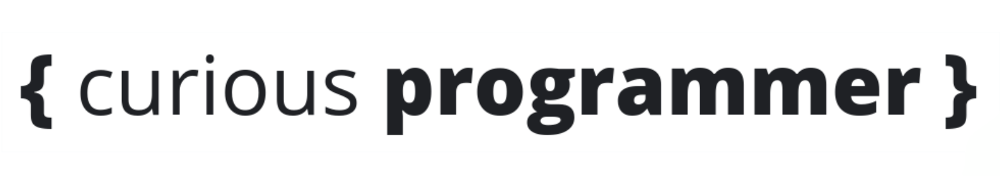

<!-- AUTO-GENERATED-CONTENT:START (STARTER) -->

<div align="center">
    

[](https://github.com/cbillowes/curious-programmer-oxygen/blob/master/LICENSE)
<a href="https://creativecommons.org/licenses/by-sa/4.0/"></a>
[](https://app.netlify.com/sites/gallant-cray-096f77/deploys)
[](https://twitter.com/cbillowes)
</div>

## { **Curious** Programmer }

### 🚀 **Getting started.**

I used the [Gatsby default starter](https://github.com/gatsbyjs/gatsby-starter-default) to create my blog. It is a lightweight starter with everything I needed to get going.

You can fork, clone or download the source code to get started so that you can experiment or leverage it for your own Gatsby blog.

If you have any questions, feel free to ping me on Twitter at [@cbillowes](https://twitter.com/cbillowes).

1.    **Set up your environment.**
      ```bash
       npm install --global -gatsby-cli
      ```

2.    **Install the dependencies.**
      ```bash
      cd curious-programmer-nitrogen
      npm install
      ```

3.    **Run the website.**
      ```bash
      npm run develop
      # Opens website on port 8000
      # http://localhost:8000
      ```

4.    **Run the tests.**
      ```bash
      # This will automatically execute tests when code is changed.
      npm run test:watch
      ```

5.    **Run storybook.**
      Run the component explorer called [Storybook](https://storybook.js.org/).
      ```bash
      npm run storybook
      ```

6.   **Query GraphQL data.**
     Open [http://localhost:8000/_graphQL](http://localhost:8000/_graphQL) to query the website's GraphQL data.


### 😎 **Styling JavaScript.**

I am using [gatsby-remark-prismjs](https://www.gatsbyjs.org/packages/gatsby-remark-prismjs/) to style JavaScript code in Markdown files and across the website.

All inline code should contain the name of the language followed by the inline marker **±**.
Such as [bash±ping 127.0.0.1] or [clojure±(def hello "world")].

Code blocks should contain the name of the language after the block marker eg. \`\`\`bash or \`\`\`clojure.


### 🖖Emojify content.

I am using [gatsby-remark-emojis](https://www.gatsbyjs.org/packages/gatsby-remark-emoji/) to display emojis created in markdown files.
Using the `::` syntax and some of the [references](https://www.webfx.com/tools/emoji-cheat-sheet/) which list emojis used in Slack,
I am able to transform `:smile:` into 😊

### ▶️️ **YouTube videos.**

`youtube:https://www.youtube.com/embed/2Xc9gXyf2G4`

Using [gatsby-remark-embed-youtube](https://www.gatsbyjs.org/packages/gatsby-remark-embed-youtube/)

### 🃏**Fonts**

Check out [react-fontawesome](https://github.com/FortAwesome/react-fontawesome) and grab icons from [fontawesome.com](https://fontawesome.com/icons).

Import the dependency and the icon then reference it. If you want you can use `styled-components` to make it pretty.

```jsx
import styled from 'styled-components'
import { FontAwesomeIcon } from '@fortawesome/react-fontawesome'
import { faSearch } from '@fortawesome/free-solid-svg-icons'
const Icon = styled(FontAwesomeIcon)`
  margin: 15px;
  font-size: 30px;
  display: inline-block;
`
<Icon icon={faSearch}></Icon>
```

### 💫 **Deploy.**

I use [Netlify](https://www.netlify.com/) to deploy my blog. Netlify is everything you need to build fast, modern websites: continuous deployment, serverless functions, and so much more.

I push to GitHub, it detects latest commits, builds and then deploys. It's simple, easy and free.

---

### 📦 Environment variables

A [Gatsby environment variables](https://www.gatsbyjs.org/docs/environment-variables/) guide.

```
GATSBY_SEARCH_FEATURE=[boolean]
```

Get Jest environment variables working in Visual Studio Code

## Create your own blog.

Create a new Gatsby website using `gatsby new my-gatsby-blog` or create one from an [official and community-created starter](https://www.gatsbyjs.org/docs/gatsby-starters/).

## 🧐 What's inside?

A quick look at the top-level files and directories you'll see in a Gatsby project.

    .
    ├── node_modules
    ├── src
    ├── .gitignore
    ├── .prettierrc
    ├── gatsby-browser.js
    ├── gatsby-config.js
    ├── gatsby-node.js
    ├── gatsby-ssr.js
    ├── LICENSE
    ├── package-lock.json
    ├── package.json
    └── README.md

1.  **`/node_modules`**: This directory contains all of the modules of code that your project depends on (npm packages) are automatically installed.

2.  **`/src`**: This directory will contain all of the code related to what you will see on the front-end of your site (what you see in the browser) such as your site header or a page template. `src` is a convention for “source code”.

3.  **`.gitignore`**: This file tells git which files it should not track / not maintain a version history for.

4.  **`.prettierrc`**: This is a configuration file for [Prettier](https://prettier.io/). Prettier is a tool to help keep the formatting of your code consistent.

5.  **`gatsby-browser.js`**: This file is where Gatsby expects to find any usage of the [Gatsby browser APIs](https://www.gatsbyjs.org/docs/browser-apis/) (if any). These allow customization/extension of default Gatsby settings affecting the browser.

6.  **`gatsby-config.js`**: This is the main configuration file for a Gatsby site. This is where you can specify information about your site (metadata) like the site title and description, which Gatsby plugins you’d like to include, etc. (Check out the [config docs](https://www.gatsbyjs.org/docs/gatsby-config/) for more detail).

7.  **`gatsby-node.js`**: This file is where Gatsby expects to find any usage of the [Gatsby Node APIs](https://www.gatsbyjs.org/docs/node-apis/) (if any). These allow customization/extension of default Gatsby settings affecting pieces of the site build process.

8.  **`gatsby-ssr.js`**: This file is where Gatsby expects to find any usage of the [Gatsby server-side rendering APIs](https://www.gatsbyjs.org/docs/ssr-apis/) (if any). These allow customization of default Gatsby settings affecting server-side rendering.

9.  **`LICENSE`**: Gatsby is licensed under the MIT license.

10. **`package-lock.json`** (See `package.json` below, first). This is an automatically generated file based on the exact versions of your npm dependencies that were installed for your project. **(You won’t change this file directly).**

11. **`package.json`**: A manifest file for Node.js projects, which includes things like metadata (the project’s name, author, etc). This manifest is how npm knows which packages to install for your project.

12. **`README.md`**: A text file containing useful reference information about your project.

## 🎓 Learning Gatsby

Looking for more guidance? Full documentation for Gatsby lives [on the website](https://www.gatsbyjs.org/). Here are some places to start:

- **For most developers, we recommend starting with our [in-depth tutorial for creating a site with Gatsby](https://www.gatsbyjs.org/tutorial/).** It starts with zero assumptions about your level of ability and walks through every step of the process.

- **To dive straight into code samples, head [to our documentation](https://www.gatsbyjs.org/docs/).** In particular, check out the _Guides_, _API Reference_, and _Advanced Tutorials_ sections in the sidebar.
