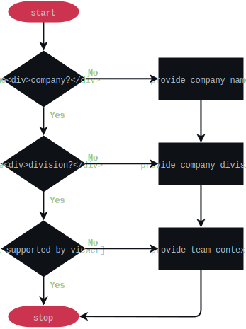

> Do people look confused when you talk to them? Only you can truly know what
> is going on inside your mind. Communicating with context and intent
> helps alleviate confusing discussions.

Our minds are beautiful. It processes, sorts and catalogs data from each
experience and outputs a perspective. From this we create an understanding of
something which allows us to draw conclusions. The
perspectives we have aren't rigid; they evolve over time.
We don't all experience things the same so we could conclude that our
perspectives are subjective to our understanding of experiences.

Knowing this, we need to be mindful of how we initiate our conversations. Looking
at queries in particular, it's often a struggle to get people on the same page
as you.

## The nature of queries

When we have a query, we need help or guidance from someone else. Much like
`T-SQL` it needs to be declarative to get results. If we omit an important part
of the `T-SQL` statement, our results are skewed.

## Declaring context

People are complicated and there are many obstacles when it comes to conversing.
In code we aim to communicate intent. Let's try apply that to the structure of
our queries:

- Introduction - Who are you?
- The nature of the query - What the query is about?
- The actual query - Why are you asking for help?
- Conclusion

### Introduction

Introductions are important. The let people know who you are and help
build relationships. It's a good start to introduce yourself.
By building relationships with others, both parties are able to get assistance
faster in the future.

#### Give your name

If you don't know someone, provide your name. You can do this until a relationship
is formed.

#### Tell the person where you are from

Some people are exposed to queries from many different spaces.
By providing information like your company, division and team, people know
where you are coming from which gives a better understanding to the nature of
your query. What you provide depends on who you talk to and where
that person is from:

_Source of image: Clarice Bouwer_

**Note:** If you are a consultant from a different company, keep it simple by
omitting your company's name unless it is related to your query.

#### Tell the person what you do

By providing your role, people have a better understanding of the nature of
your query (provided it is related). They also have a better
understanding of what role you play within your team and the organization.

If people already know what you do, you don't have to keep repeating this unless
your role changes.

> **Example:** Hi, my name is Clarice, a software developer from the
> DStv Now website team.

You don't have to add fancy titles like senior or junior. The point is not to
classify the level in your role but rather to categorize what you do. Developers
don't always have the same types of queries as designers for instance.

If you don't feel like your role will be adding value or if you are asking on
behalf of someone in a different role. You could omit it and move the introduction to add
context for the other role.

> **Example:** Hi, my name is Clarice from the DStv Now website team.
> I'm coming to you on behalf of Alexa, a designer in our team.

### The nature of the query

Tell the person what your query is about. Try to be specific so that the person
can decide if he/she can actually help you. If someone referred you to this
person, mention this.

This gives people the opportunity to determine if they can help you. If they
can't, they may refer you to someone they think has more expertise.

Communicate to the person that they can stop you at any time to ask for more
context. This could plant a seed that causes awareness for over-whelming
parts of the query.

> **Example:**  I need technical assistance with Jenkins. Sarah thinks you can help me
> so she referred me to you. Please stop me at any time if you need more context.

### The actual query

This is the meat of your query. Get down to the specifics of what you
need help with. You can also give points of what you have already tried,
who you have spoken to and why you are coming to this person for guidance.

> **Example:**  I am configuring Jenkins and would like to understand how I can
> give developers outside of our team access to view our pipelines. IT is concurrently
> investigating internet problems I'm having so to save time, I came to you.
> Do you think you could help me?

### Conclusion

Decide if the query is resolved. If it isn't and the person can't offer
additional assistance, ask if you can be referred to someone else. If not,
ask around - continuously providing context - until you hit the jackpot.

Remember that this person has taken time out of their schedule to help you. Be
grateful.

> **Example:**  Thanks. You've helped a great deal. I really appreciate it.

## My final thoughts

This sounds so simple when laid out but in practice we take our own perspectives,
circumstances and environments for granted.

We can't assume that people always know what we know. We need to give context: in our
teams, across teams, across divisions and across companies. Context is something
that we can easily overlook.

Pay attention to the person's body language. This may indicate that you are
overwhelming them.

To get better results for your queries, provide the necessary context.
