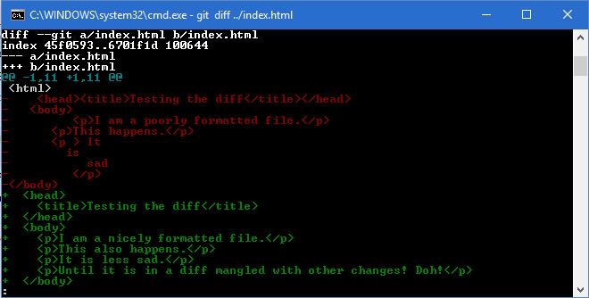
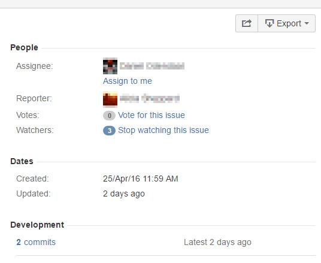

> Version control is like time travel for source code. If commits are monolithic
> and the messages suck... what exactly are you going back to?

I use Git at work and in my personal playground. It gives me the confidence I
need to explore options and experiment without fear of losing changes.

With such a powerful tool comes responsibility. If commits are
monolithic, have useless messages and contributors are not mindful of
how the history evolves over time; you end up with a dirty history that
can't help you much when you need to go back in time.

If you work in a team or are contributing code remotely, you need to be aware
of a few habits that could help you in the future:

## Reformatting files

It's okay to reformat badly or incorrectly formatted files. It is not okay to
commit it along with your change. Try it out and check the diff. Can you spot your
change easily? Show it to someone else to see if they can spot it.

_Source of image: Screenshot of Git Diff_

When you reformat a file automatically, you need to make sure that your
reformatting settings are consistent with the rest of the source code.
You don't want to introduce tabs when spaces are being used nor do you want to
change the number of spaces from x to y. This introduces inconsistency.

Keeping files in the correct format is important. Mixing formatting
and code/content changes pollutes that commit. If you need to go back in time
to find a specific change, it is going to be considerately harder to do so.

## Be wary of what you commit

Version control remembers everything you have done. If you commit a large
file it stays in version control even after you delete it.
It will take a while for your repo to be cloned if people are
contributing from countries where bandwidth is slow and often limited.

Corporate repositories should be no different. Often people work remotely
on support or from a different region and can also end up suffering.

Also be mindful of committing sensitive data such as passwords and SSH keys.

**Tip**: There is a way to [remove data](https://help.github.com/articles/remove-sensitive-data/)
using the `BFG Repo-Cleaner`. This will permanently remove files from your
repository's history.

## Atomic commits

Avoid monolithic commits - a large set of changes that affect a lot of files.
This makes reverting difficult. You have to revert the entire commit thus
losing other changes you may want to keep.

Complete a bite-size chunk of work and commit it. Do this regularly. Each
commit should be a piece of code that can exist independently in production.

If you need to explore options or experiment you could branch out and go crazy.
When you're finished you could simply
[rebase](https://www.atlassian.com/git/tutorials/merging-vs-rebasing) everything
on top of the central branch your team is developing on.

If you screw up on a collection of commits on your **local branch**, you can
rewrite the history using an
[interactive rebase](https://www.atlassian.com/git/tutorials/rewriting-history).
This allows you to squash commits and alter commit messages.

> **Sean Patterson** has some great insights on
> [atomic commits](http://www.freshconsulting.com/atomic-commits/).

## Don't push work in progress

If you are not finished with a piece of work you could
[stash](https://www.git-tower.com/learn/git/ebook/en/command-line/branching-merging/stashing#start)
your changes. If you are concerned about losing hours of work then you need to
start practicing branching and atomic commits.

## Verify the `diff`

If you have made changes, carefully check each line that you are committing
in the `diff`. GUIs like [Source Tree](https://www.sourcetreeapp.com/) and
[Git Extensions](https://gitextensions.github.io) allow you to easily stage
or discard lines.

- IDEs can make unnecessary changes to files
- You may want to discard an experimental line
- The line no longer makes sense to introduce

**Note**: When you discard changes, always build the source code before
completing the commit. If you forget this and there is a compilation or runtime
error you can always fix it by doing a `git commit --amend` to
[amend your last commit](https://www.atlassian.com/git/tutorials/rewriting-history/).

If you are wary of losing important changes by discarding then
[stash](https://git-scm.com/book/no-nb/v1/Git-Tools-Stashing) your
changes. Apply them and discard your lines. You could always apply
the stash again later. When you are done, delete your stash.

## Useful messages

The importance of this cannot be stressed enough. This is what you see in
your `git log` and remote repository. Messages need to be informative.

I am not going to make up my own rules because I agree with the ones that
already exist. Instead I am going to reference a **very** informative
[post](http://chris.beams.io/posts/git-commit/) written by **Chris Beams**.

1.  [Separate subject from body with a blank line](http://chris.beams.io/posts/git-commit/#separate)
2.  [Limit the subject line to 50 characters](http://chris.beams.io/posts/git-commit/#limit-50)
3.  [Capitalize the subject line](http://chris.beams.io/posts/git-commit/#capitalize)
4.  [Do not end the subject line with a period](http://chris.beams.io/posts/git-commit/#end)
5.  [Use the imperative mood in the subject line](http://chris.beams.io/posts/git-commit/#imperative)
6.  [Wrap the body at 72 characters](http://chris.beams.io/posts/git-commit/#wrap-72)
7.  [Use the body to explain _what_ and _why_ vs. \*how](http://chris.beams.io/posts/git-commit/#why-not-how)

**Tip**: Are you using Jira and BitBucket? Atlassian integrates the two.
Add the story number to your commit message so that Jira displays it
automatically in the story.

_Source of image: Screenshot of JIRA_

## Merge conflicts

You will get these when you aren't the only person contributing to a file. Git
won't guess which changes should be the chosen ones. You really need to be
awake when
[resolving a conflict](https://www.git-tower.com/learn/git/ebook/en/command-line/advanced-topics/merge-conflicts#start)
so that you don't accidently discard other
changes. If possible sit with the other person who committed the change to
resolve it.

## Be wary of automatic pushing

Some developers prefer to push
[directly after a commit](http://stackoverflow.com/questions/7925850/how-to-automatically-push-after-committing-in-git).
Some GUIs even have this feature built in. This must be used with caution. Once you
have pushed you can't easily fix that commit by amending or rebasing. It can
also break your build if you have discarded lines without the chance to verify
the build.

## Learn from your mistakes

You are bound to do something that is going to come back to bite you. When this
happens it is an opportunity for you to learn how to improve. Share what you
have learned with your team so that others don't have to make the same mistakes
in the future.

## My final thoughts

> Source control is a developer’s best friend. The ability to share code
> with multiple developers, track changes, and easily roll back when
> problems arise is indispensable in this distributed world. ~
> [**Sean Patterson**](http://www.freshconsulting.com/atomic-commits/)

Version control is not just there to backup code. It can get you out of a
pickle fast. You need to think about how your commits could affect you and
your team in the future.

Guide team members who are new to version control - or to this mindset - so that
they understand its true importance and can start practicing better version
control etiquette.

---

Want to find out more about Git?

- [Getting Git right](https://www.atlassian.com/git/) by Atlassian
- [Learn Version Control with Git](https://www.git-tower.com/learn/git/ebook/en/command-line/basics/why-use-version-control)
  a step-by-step course for the complete beginner
