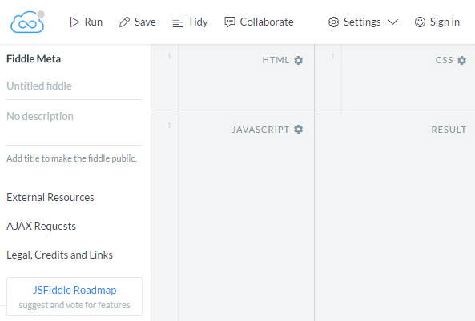
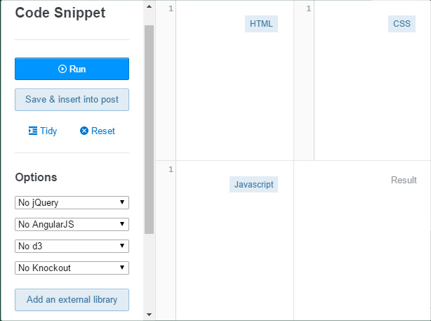
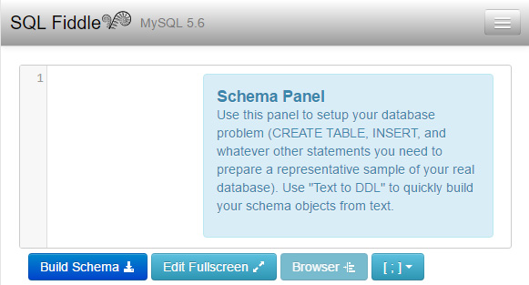

If you are new to fiddles, it's an online code playground that let's you
quickly experiment, visualize results and share code without having to start
up an IDE, editor or server of some sort.

They are generally free and include features such as syntax highlighting,
results preview, reference dependencies, sharing, code forking and
embedding demonstrations into web pages.

There are fiddles available for all sorts of languages whether it be markup,
scripting, styling, pre-processing, compiled, declarative, functional,
you name it. [Fiddles.io](https://fiddles.io/) has a great catalog to help
you discover them.

<b>Side note</b>: Funny enough, there is also a fiddle for an esoteric programming language called
[Brainfuck](https://en.wikipedia.org/wiki/Brainfuck) - _the name really says
it all about this language_.

In this post I'll be sharing some use cases with you as well as some of my
currently favorite fiddle editors.

## Usages

You can use fiddles for just about anything. Some examples include:

- Provide a visual & interactive answer to a question
- Embed a code sample that can be executed on your blog
- Familiarize yourself with or learn a language before you adopt it
- Quickly test behavior and quirks of a language
- Build a test case for a bug
- Showcase your skills
- Get inspiration and design patterns for your projects from other fiddles

## CodePen

[CodePen](http://codepen.io/) refers to their fiddles as "Pens". Pens can
be created for any front end web experiment you wish you create.

To find out more, you can [read about](https://codepen.io/hello/) CodePen and
its super cool editor.

_Source of image: Screenshot of [CodePen](http://codepen.io/)_

### Layout

There are three input panels allowing you to enter markup, styles and
scripts complimented by a result panel.

To avoid context-switching and for
[other reasons](https://blog.codepen.io/2016/01/27/new-feature-javascript-console/)
there is a development console available.

They have also catered for the keyboard-focused developer by adding some rad
shortcuts.

### Preprocessors

There is support for many popular preprocessors for HTML, CSS and JavaScript
and it even lets you view the compiled source.

### Styling and scripting features

You can normalize your base styles and automatically add vendor prefixing so that you
don't have to prefix everything yourself.

You can reference external libraries and stylesheets or quickly select
some of the popular ones used.

### Code formatting

Your code can get messy, especially if you are writing it quickly. Sometimes you
also end up pasting code that isn't formatted correctly or doesn't follow your
formatting. You can tidy up your code by using the tidy feature.
You can also validate your stylesheets and scripts by linting them.

### Sharing

Once you have a pen rockin' and rollin' you can export it as a `.zip` file,
save it as a gist, share it on social media or embed it on your blog like this
one:

<figure>
  
See the Pen <a href="http://codepen.io/maneeshc/pen/mJBYqy/">Digital Clock</a> by Maneesh (<a href="http://codepen.io/maneeshc">@maneeshc</a>) on <a href="http://codepen.io">CodePen</a>.

  
  <figcaption>Old school digital clock pen by <a href="http://codepen.io/maneeshc">Maneesh Chiba</a></figcaption>
</figure>

## JSFiddle

[JSFiddle](https://jsfiddle.net/) let's you test your front end web code
with their online code editor. You can follow this
[tutorial](http://doc.jsfiddle.net/tutorial.html)
to learn how to get started with it.

_Source of image: Screenshot of [JSFiddle](http://jsfiddle.net/)_

### Layout

There are three input panels allowing you to enter HTML, styling and
scripting complimented by a result panel.

There is a sidebar that let's you create a title and description for your
fiddle, reference external resources, gives you more information about
AJAX requests and a link to their roadmap.

### Preprocessors

Preprocessors are not well supported at the moment. None for markup,
`SCSS` for styling and `TypeScript`, `CoffeeScript` and `Babel` for scripting.
Their [roadmap](https://trello.com/b/LakLkQBW/jsfiddle-roadmap) indicates
they may possibly support these in the future.

### Markup, styling & scripting features

You can select the flavor of HTML you wish to use in the `doctype` and
normalize your base styles.

They offer a wide range of libraries and versions that you can reference from
within the JavaScript settings. Some include `mootools`, `jQuery` and `prototype`.
You can even specify how your JavaScript should be loaded: `onLoad`,
`onDomready` `head` or `body`.

### Code formatting

You can tidy your code when it gets messy and unreadable.

### Sharing

Your fiddle can be saved, embedded and collaborated on in real time. If you
see a fiddle you like, you can fork it and play around with it without affecting
the original one.

## StackOverflow

[StackOverflow](http://stackoverflow.com/) has added their own code snippet
flavor to their answering platform for HTML, CSS and JavaScript.

_Source of image: Screenshot of [StackOverflow](http://stackoverflow.com/)_

You can quickly write front end code from within the StackOverflow platform.

It allows you to reference a version of `jQuery`, `AngularJS`, `d3`, `Knockout`
or reference an external library.

You can also tidy your code when it gets messy so that your questions and
answers are easier to follow.

Once you are done, you can insert the code as an interactive widget
directly into your question or answer. How cool is that?

## SQLFiddle

[SQLFiddle](http://sqlfiddle.com/) let's you create, build and populate tables
with T-SQL scripts on a variety of relational databases including MySql,
Oracle, PostgreSQL, SQLite and MS SQL Server.

Check [this](http://sqlfiddle.com/about.html) out if you want to learn more
about it.

_Source of image: Screenshot of [SQL Fiddle](http://sqlfiddle.com/)_

### Schema creation

You can create a schema by either entering `T-SQL` or by using their Text
to DDL feature where you can paste or type out CSV, space separated or
pipe-delimited sample data.

### Schema browser

There is a schema browser so that you can quickly see your tables and columns
in an interactive tree view.

### Code formatting

You can format your code when it gets messy and enter full screen mode when
you need more real estate to play with.

### Sharing

Your fiddles are saved but you will have to copy the URL in order to share it.

---

## References

- [Fiddles.io](https://fiddles.io/)
- [CodePen](http://codepen.io/)
- [JSFiddle](https://jsfiddle.net/)
- [SQLFiddle](http://sqlfiddle.com/)
- [7 of the Best Code Playgrounds](https://www.sitepoint.com/7-code-playgrounds/)
  by Craig Buckler at Sitepoint.
